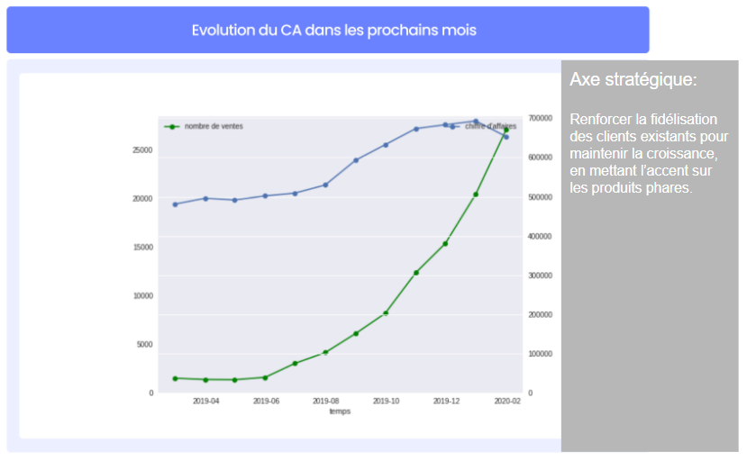
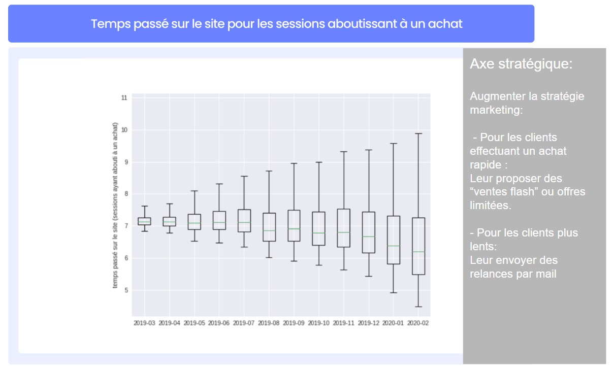
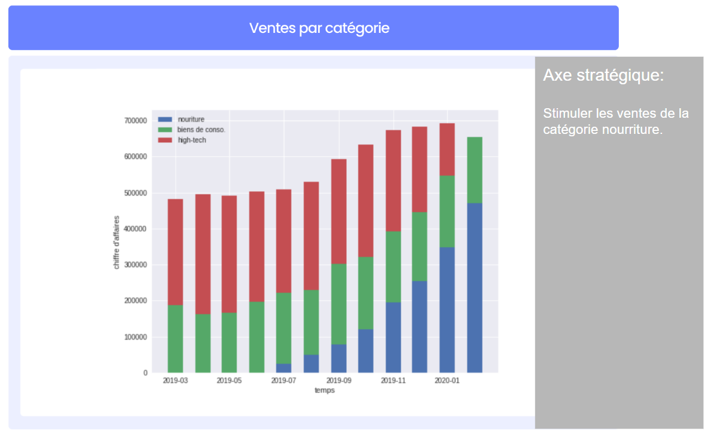

# 📊 Analyse du rapport mensuel marketing

## 🧾 Présentation du projet

Ce projet consiste à analyser les performances marketing d’une entreprise à partir de données issues d’un fichier Excel.

---

## 🎯 Objectifs de l’analyse

- Analyser l’évolution du chiffre d’affaires dans le temps  
- Étudier le comportement des utilisateurs sur le site  
- Comprendre la répartition des ventes par catégorie  
- Identifier des tendances de consommation  
- Proposer des recommandations stratégiques

---

## 📊 Graphiques analysés

### 📉 1. Évolution du chiffre d’affaires

Ce graphique présente l’évolution du chiffre d’affaires sur la période étudiée.

👉 Analyse :
On observe une variation du chiffre d’affaires dans le temps, permettant d’identifier une tendance globale de performance.

👉 Recommandation :
Renforcer la fidélisation des clients existants afin de stabiliser et maintenir la croissance.

---

### 📦 2. Temps passé sur le site avant achat (Boxplot)

Ce graphique représente la distribution du temps passé sur le site pour les sessions ayant abouti à un achat.

👉 Analyse :
La majorité des utilisateurs réalisent un achat dans une plage de temps relativement stable, avec quelques valeurs extrêmes.

👉 Recommandation :
Optimiser le parcours utilisateur afin de réduire le temps nécessaire à la conversion et améliorer l’expérience client.

---

### 📊 3. Ventes par catégorie de produits

Ce graphique compare les ventes entre les différentes catégories : nourriture, biens de conso et high-tech.

👉 Analyse :
La catégorie nourriture représente la part la plus importante du chiffre d’affaires, tandis que le high-tech est en baisse suite à un changement stratégique.

👉 Recommandation :
Renforcer les actions marketing sur la catégorie nourriture afin de maximiser la performance globale.

---

## 🧠 Conclusion

Cette analyse permet de mieux comprendre :

- l’évolution des performances commerciales
- le comportement des utilisateurs
- l’impact des catégories de produits sur le chiffre d’affaires

Elle met en évidence des axes d’optimisation liés à la fidélisation client et à la stratégie produit.

---

## 🛠️ Outils utilisés

- Excel 
- Analyse de données  
- Visualisation de données  
- Graphiques (boxplot, courbes, barres)
  
---

## 📷 Aperçu des graphiques

