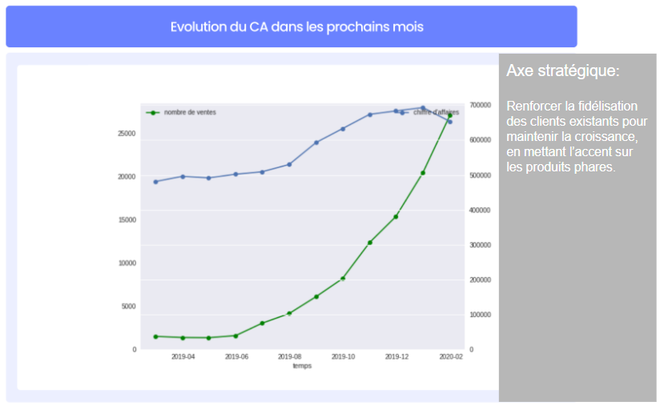
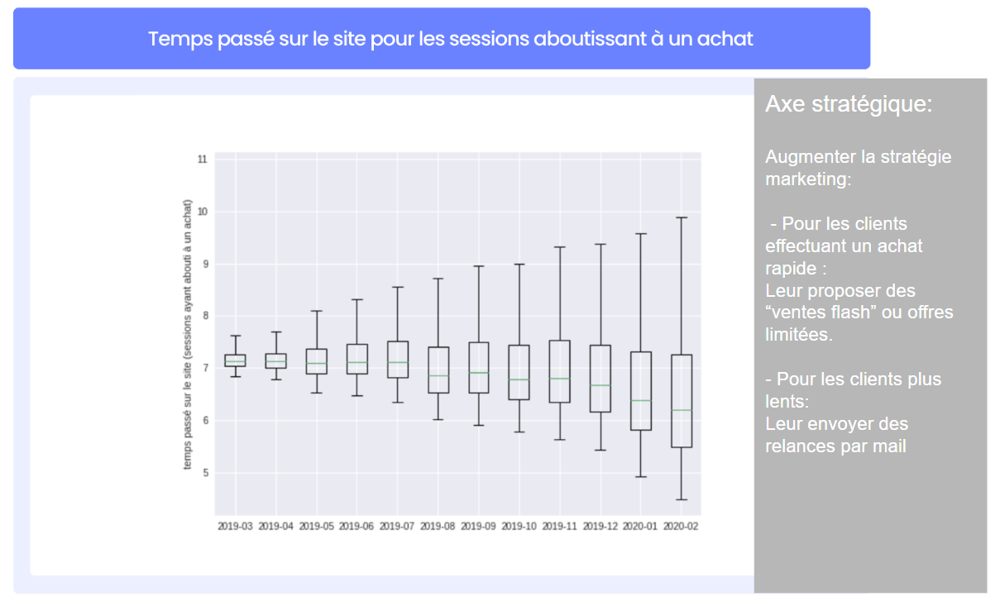
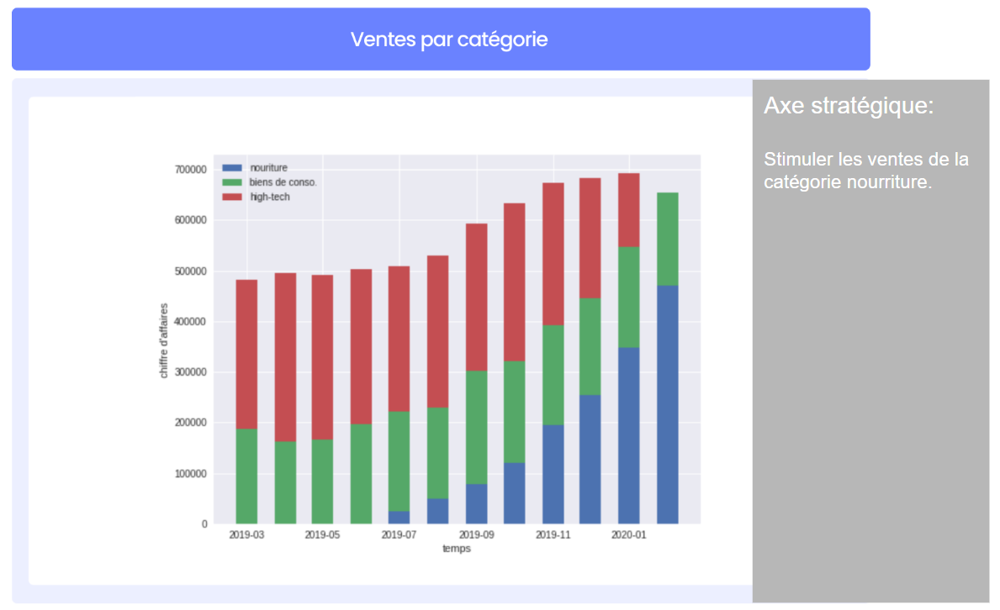

# 📊 Monthly Marketing Report Analysis

## 🧾 Project Overview

This project analyzes marketing performance using data extracted from an Excel file.

The goal was to understand business performance, user behavior, and product dynamics in order to support data-driven decisions.

---

## 🎯 Objectives

- Track revenue trends over time  
- Analyze user behavior on the website  
- Understand sales distribution across product categories  
- Identify key consumption patterns  
- Translate insights into actionable recommendations  

---

## 📊 Key Insights & Visualizations

### 📉 1. Revenue Trend

This chart shows how revenue evolved over the analyzed period.

👉 Insight:  
Revenue fluctuates over time, highlighting an overall performance trend with periods of growth and decline.

👉 Business impact:  
Improving customer retention would help stabilize revenue and support sustainable growth.

---

### 📦 2. Time to Purchase (Boxplot Analysis)

This visualization shows the distribution of time spent on the website before completing a purchase.

👉 Insight:  
Most conversions happen within a consistent time range, with a few extreme cases.

👉 Business impact:  
Optimizing the user journey could reduce friction and improve conversion speed.

---

### 📊 3. Sales by Product Category

This chart compares sales performance across product categories: food, consumer goods, and high-tech.

👉 Insight:  
The food category drives the majority of revenue, while high-tech shows a decline following a strategic shift.

👉 Business impact:  
Focusing marketing efforts on the food category could maximize overall performance.

---

## 🧠 Key Takeaways

This analysis highlights:

- Clear revenue trends and performance cycles  
- Strong patterns in user behavior  
- Uneven performance across product categories  

It also identifies opportunities to improve retention and refine product strategy.

---

## 🛠️ Tools & Skills

- Excel  
- Data analysis  
- Data visualization  
- Business reporting  
- Charts (line charts, boxplots, bar charts)

---

## 📷 Dashboard Overview

Revenue evolution in the coming months :

Time spent on the website for sessions resulting in a purchase :

Sales by category :

---

# 📊 Analyse du rapport mensuel marketing

## 🧾 Présentation du projet

Ce projet consiste à analyser les performances marketing d’une entreprise à partir de données issues d’un fichier Excel.

---

## 🎯 Objectifs de l’analyse

- Analyser l’évolution du chiffre d’affaires dans le temps  
- Étudier le comportement des utilisateurs sur le site  
- Comprendre la répartition des ventes par catégorie  
- Identifier des tendances de consommation  
- Proposer des recommandations stratégiques

---

## 📊 Graphiques analysés

### 📉 1. Évolution du chiffre d’affaires

Ce graphique présente l’évolution du chiffre d’affaires sur la période étudiée.

👉 Analyse :
On observe une variation du chiffre d’affaires dans le temps, permettant d’identifier une tendance globale de performance.

👉 Recommandation :
Renforcer la fidélisation des clients existants afin de stabiliser et maintenir la croissance.

---

### 📦 2. Temps passé sur le site avant achat (Boxplot)

Ce graphique représente la distribution du temps passé sur le site pour les sessions ayant abouti à un achat.

👉 Analyse :
La majorité des utilisateurs réalisent un achat dans une plage de temps relativement stable, avec quelques valeurs extrêmes.

👉 Recommandation :
Optimiser le parcours utilisateur afin de réduire le temps nécessaire à la conversion et améliorer l’expérience client.

---

### 📊 3. Ventes par catégorie de produits

Ce graphique compare les ventes entre les différentes catégories : nourriture, biens de conso et high-tech.

👉 Analyse :
La catégorie nourriture représente la part la plus importante du chiffre d’affaires, tandis que le high-tech est en baisse suite à un changement stratégique.

👉 Recommandation :
Renforcer les actions marketing sur la catégorie nourriture afin de maximiser la performance globale.

---

## 🧠 Conclusion

Cette analyse permet de mieux comprendre :

- l’évolution des performances commerciales
- le comportement des utilisateurs
- l’impact des catégories de produits sur le chiffre d’affaires

Elle met en évidence des axes d’optimisation liés à la fidélisation client et à la stratégie produit.

---

## 🛠️ Outils utilisés

- Excel 
- Analyse de données  
- Visualisation de données  
- Graphiques (boxplot, courbes, barres)
  
---

## 📷 Aperçu des graphiques

